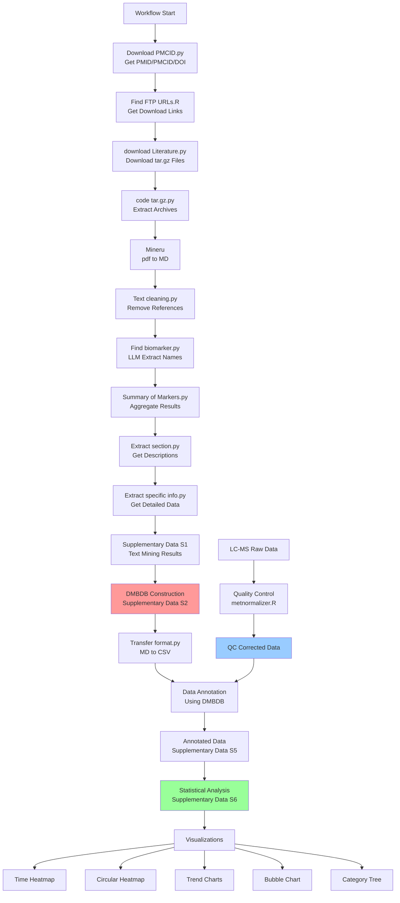

# Large Language Model-Generated Dietary Metabolite Biomarker Database (DMBDB)

This repository contains the supplementary materials, code, and data for the research paper **"Large Language Model-Generated Dietary Metabolite Biomarker Database Drives Deep Annotation of the Human Diet Metabolome"**.

## Overview

This project presents a comprehensive AI-powered workflow that combines:
- **Automated literature mining** using Large Language Models (LLMs) to extract dietary biomarker information from thousands of scientific publications
- **Construction of DMBDB** - a comprehensive Dietary Metabolite Biomarker Database with chemical structures, food sources, and analytical methods
- **Metabolomics data analysis** with rigorous quality control and normalization
- **Multi-dimensional visualization** of metabolic patterns and temporal dynamics after food intake

## Repository Structure

```
.
├── Text mining code/              # AI-powered literature mining pipeline
├── Quality Control Correction/    # LC-MS data normalization using MetNormalizer
├── Drawing code/                  # Data visualization scripts
│   ├── Time heatmap/             # Time-series heatmaps
│   ├── Circular Time Heatmap/    # Polar coordinate heatmaps
│   ├── Metabolic trend chart/    # Individual metabolite trends
│   ├── Bubble score chart/       # Scoring visualizations
│   └── Dietary biomarker categories/ # Phylogenetic tree-style classification
├── Supplementary Data/            # Research datasets and DMBDB
└── Large Language Model-Generated Dietary Metabolite Biomarker Database...docx
```

## 1. Text Mining Pipeline

The text mining pipeline uses Large Language Models (DeepSeek API) to automatically extract dietary biomarker information from scientific literature. The complete workflow includes 11 sequential steps:

### 1.1 Literature Retrieval & Preprocessing

**Step 1: Download PMCID.py**
- Searches PubMed with article titles
- Extracts PMID, PMCID, and DOI identifiers
- Saves results to Excel file
- **Requirements**: `requests`, `beautifulsoup4`, `pandas`

**Step 2: Find the FTP download address by using PMCID.R**
- Converts PMCID to FTP download URLs for full-text articles
- **Requirements**: R packages for PMC data access

**Step 3: download Literature.py**
- Downloads articles in tar.gz format from FTP URLs
- Uses PMCID as filename for tracking
- **Requirements**: `requests`, `pandas`

**Step 4: code tar.gz.py**
- Extracts compressed tar.gz files
- Prepares articles for text processing

**Step 5: Mineru**
- Use Mineru to convert PDF files into Markdown format.

**Step 6: Text cleaning.py**
- Removes reference sections from articles
- Converts .md files to .txt format
- Cleans unnecessary formatting

### 1.2 AI-Powered Biomarker Extraction

**Step 7: Find biomarker.py**
- **Function**: Uses DeepSeek LLM to extract dietary biomarker names from literature
- **Method**: Processes each .txt file with specialized prompt engineering
- **Output**: Dietary biomarker names in table format
- **Key Features**:
  - Excludes disease-related markers
  - Requires full chemical names (not abbreviations)
  - Temperature=0 for consistent results

**Step 8: Summary of Markers.py**
- Aggregates biomarkers from all processed files
- Creates a consolidated list with file source tracking
- Outputs format: `filename: biomarker_name`

**Step 9: Extract section.py**
- Extracts text sections describing each specific biomarker
- Uses concurrent processing (5 workers) for efficiency
- Saves individual files per biomarker-paper combination
- **Output**: `{biomarker_name}_{paper_name}.txt`

**Step 10: Extract specific information.py**
- **Function**: Extracts detailed structured information for each biomarker:
  - Biomarker Name
  - Food Source (e.g., coffee, beef, protein intake)
  - Sample Size (number of participants)
  - Biological Sample (e.g., urine 24hr, plasma)
  - Analytic Procedure (e.g., HPLC, FT-ICR-MS)
  - Literature Name (PMCID)
- **Output**: Markdown table consolidated into CSV

**Step 11: Transfer format.py**
- Converts Markdown tables to CSV format
- Standardizes data structure for downstream analysis

**Final Output**: `Supplementary Data S1 Text mining results.csv`

### 1.3 Installation & Setup

```bash
# Python dependencies
pip install openai pandas requests beautifulsoup4

# R packages (for Step 2)
# Install required R packages for PMC access
```

**Important**:
- You must provide your own DeepSeek API key in the scripts
- Replace `api_key=""` with your actual key
- Base URL: `https://api.deepseek.com`
- Comply with PubMed's terms of service for literature access

## 2. Quality Control and Data Normalization

### 2.1 Metabolomics Data Processing

**Script**: `metnormalizer.R`

Uses the **MetNormalizer** package for comprehensive quality control and normalization of LC-MS metabolomics data.

**Features**:
- QC sample-based signal correction
- Missing value handling with customizable thresholds
- Parameter optimization (with `optimization = TRUE`)
- Parallel processing support (`threads = 4`)

**Input Files**:
- `data.csv` - Raw metabolite intensity matrix
- `sample.info.csv` - Sample metadata (QC/Sample labels, batch info, injection order)

**Key Parameters**:
```r
minfrac.qc = 0        # QC retention threshold
minfrac.sample = 0    # Sample retention threshold
optimization = TRUE   # Enable parameter optimization
multiple = 5          # Optimization fold
threads = 4           # Parallel threads
```

### 2.2 Installation

```r
install.packages("MetNormalizer")
```

### 2.3 Output

**`QC correction results.xlsx`** - Normalized and quality-controlled metabolomics data ready for downstream analysis

**Reference**: [MetNormalizer on CRAN](https://CRAN.R-project.org/package=MetNormalizer)

## 3. Data Visualization

All visualization scripts use Arial font and produce high-resolution (300 dpi) publication-quality figures.

### 3.1 Time Series Heatmap

**Script**: `Drawing code/Time heatmap/Time heatmap.py`

Creates comprehensive heatmaps showing metabolite intensity changes across time points.

**Input**:
- `N_matched_out.xlsx` - Metabolite data with time-stamped columns (format: `Month.Day-HH:MM`)

**Key Features**:
- **Data transformation**: Log1p transformation followed by Z-score normalization
- **Time parsing**: Automatically extracts and sorts datetime from column names
- **Day labeling**: Groups time points by day (Day1, Day2, etc.)
- **Color scheme**: `vlag` colormap with centered scaling (vmin=-2, vmax=2)
- **Output format**: PNG with metabolite names hidden (for large datasets)

**Technical Details**:
```python
# Normalization pipeline
df_log = np.log1p(df_sorted)
df_scaled = StandardScaler().fit_transform(df_log.T).T
```

### 3.2 Circular Time Heatmap

**Script**: `Drawing code/Circular Time Heatmap/Circular Time Heatmap.py`

Generates polar coordinate circular heatmaps for visualizing metabolite patterns after food consumption.

**Input Files**:
- `n.csv` (or `z.csv`) - Metabolite intensity data with time columns
- `metabolites.csv` - Metabolite-to-food mapping (columns: Name, food)

**Key Features**:
- **Food grouping**: Automatically groups metabolites by food source (coffee, chocolate, banana)
- **Keyword-based classification**: Uses chemical name patterns to assign unlabeled metabolites
  - Coffee: caffeine, methylxanthine, chlorogenic, quinic, ferulic
  - Chocolate: catechin, epicatechin, theobromine, cianidanol
  - Banana: dopamine, serotonin, tryptophan, tryptamine
- **Polar layout**: Circular arrangement with color-coded food group boundaries
- **Z-score normalization**: Centered color mapping (vmin=-3, vcenter=0, vmax=3)
- **Visual separation**: Adjustable gaps between food groups (`gap_size = 3`)

**Output**: Circular heatmap with radial time labels and food-specific color borders

### 3.3 Metabolic Trend Chart

**Script**: `Drawing code/Metabolic trend chart/Metabolic trend chart.py`

Plots individual metabolite concentration trends over time with food intake event markers.

**Input**:
- `cretaine_sgmns_results.xlsx` (or `Z_matched_out.xlsx`) - Time-series metabolite data

**Key Features**:
- **Food event markers**: Vertical dashed lines indicating consumption times
  - Coffee (9:00) - Gray dashed line
  - Dark Chocolate (15:00) - Pink dashed line
  - Banana (20:00) - Yellow dashed line
- **Multi-day tracking**: Focuses on last 7 days of data
- **Automated plotting**: Generates individual plots for each metabolite
- **Time axis**: Formatted as `Day1-HH:MM` for clarity

**Output**: PNG files for each metabolite saved to specified directory

### 3.4 Bubble Score Chart

**Script**: `Drawing code/Bubble score chart/Bubble score chart.py`

Visualizes biomarker scoring results with bubble size and color representing score magnitude.

**Input**:
- `score.xlsx` - Contains columns: `Biomarker Name`, `score`

**Key Features**:
- **Top N selection**: Displays top 50 biomarkers by score (customizable)
- **Dual encoding**: Bubble size and color both represent score
- **Color gradient**: Blue-white-red gradient (low to high scores)
- **Score labels**: Numeric values displayed next to each bubble
- **Ranked display**: Biomarkers sorted by score in descending order

**Customization**:
```python
plot_labeled_bubble(df, output_folder='output', top_n=50)
```

### 3.5 Dietary Biomarker Categories

**Script**: `Drawing code/Dietary biomarker categories/Dietary biomarker categories.R`

Creates phylogenetic tree-style circular classification diagrams using ggtree.

**Input**:
- `Dietary biomarker categories.csv` - Must contain columns: `class`, `superclass`, `number`

**Key Features**:
- **Circular layout**: Tree visualization with circular arrangement
- **Hierarchical structure**: Two-level hierarchy (superclass → class)
- **Size mapping**: Bubble size represents the number of biomarkers in each category
- **Color coding**: Different colors for each superclass
- **Custom labels**: Class names displayed at tips with appropriate offsets

**R Packages Required**:
```r
library(treeio)
library(ggplot2)
library(ggtree)
```

**Output**: Circular dendrogram showing hierarchical classification of dietary biomarkers

### 3.6 Visualization Dependencies

```bash
# Python packages
pip install pandas numpy matplotlib seaborn scikit-learn openpyxl

# R packages
install.packages(c("treeio", "ggplot2", "ggtree"))
```

## 4. Supplementary Data

The `Supplementary Data/` folder contains all research datasets and database files:

| File | Description | Content |
|------|-------------|---------|
| **Supplementary Data S1** | Text mining results | Extracted dietary biomarkers with metadata from literature analysis |
| **Supplementary Data S2** | DMBDB (CSV format) | Core Dietary Metabolite Biomarker Database with chemical structures |
| **Supplementary Data S3** | LC-MS database (Excel) | Extended dietary biomarker LC-MS database (Open Source Data only) |
| **Supplementary Data S4** | Text mining scores | Scoring metrics for biomarker extraction quality |
| **Supplementary Data S5** | Original data annotation | Metabolomics annotation results from experimental data |
| **Supplementary Data S6** | Differential analysis | Statistical analysis results comparing metabolite levels |

### 4.1 DMBDB - Dietary Metabolite Biomarker Database

The core database (`Supplementary Data S2 DMBDB.csv`) contains comprehensive information for each dietary biomarker:

**Database Fields**:
- **Biomarker ID & Name**: Unique identifier and standardized name
- **Chemical Identifiers**: SMILES, InChI, InChIKey for computational applications
- **Molecular Properties**: Molecular formula, exact mass, molecular weight
- **Food Sources**: Specific foods associated with each biomarker
- **Biological Context**:
  - Sample types (e.g., urine, plasma, serum)
  - Sample collection protocols (e.g., 24-hour urine, fasting samples)
  - Sample sizes from validation studies
- **Analytical Methods**: LC-MS techniques used for detection (e.g., HPLC, UPLC-MS/MS, FT-ICR-MS)
- **Literature References**: PMCIDs linking to source publications

**Applications**:
- Metabolomics data annotation
- Dietary intake assessment
- Biomarker discovery and validation
- Mass spectrometry database matching

## 5. Complete Workflow Diagram



**Workflow Summary**:
1. **Literature Mining** (Steps A→L): AI-powered extraction of dietary biomarkers from PubMed literature
2. **Database Construction** (Step M): Building DMBDB from extracted information
3. **Data Processing** (Steps N→P): Quality control and normalization of metabolomics data
4. **Data Annotation** (Step Q): Matching experimental data with DMBDB
5. **Statistical Analysis** (Steps R→S): Differential analysis and scoring
6. **Visualization** (Steps T→Y): Multi-dimensional data visualization

## 6. Key Features

- **Automated Literature Mining**: Uses Large Language Models (DeepSeek) to extract dietary biomarkers from thousands of scientific papers with high precision
- **Comprehensive Database**: DMBDB contains detailed chemical, biological, and analytical information for dietary biomarkers
- **Rigorous Quality Control**: MetNormalizer-based QC with parameter optimization ensures data reliability
- **Multi-Dimensional Visualization**: Five complementary visualization approaches for exploring temporal metabolic patterns:
  - Time-series heatmaps for overview
  - Circular polar plots for food-specific patterns
  - Individual trend charts for detailed tracking
  - Bubble charts for scoring visualization
  - Phylogenetic-style trees for classification
- **Reproducible Research**: All code, data, and workflows provided for full reproducibility
- **Food Intake Validation**: Experimental validation with controlled food consumption (coffee, chocolate, banana)

## 7. Usage Examples

### 7.1 Running the Text Mining Pipeline

```bash
# Step 1: Get PMCIDs from article titles
python "Text mining code/Download PMCID.py"

# Step 2: Get FTP download URLs (R script)
Rscript "Text mining code/Find the FTP download address by using PMCID.R"

# Step 3: Download literature
python "Text mining code/download Literature.py"

# Step 4-6: Process and clean text
python "Text mining code/code tar.gz.py"
mineru:https://mineru.net/ or deploy the mineru model locally
python "Text mining code/Text cleaning.py"

# Step 7-10: Extract biomarker information using LLM
python "Text mining code/Find biomarker.py"
python "Text mining code/Summary of Markers.py"
python "Text mining code/Extract section.py"
python "Text mining code/Extract specific information.py"
```

# Step 11: Output the data in CSV format.
python "Text mining code/Transfer format.py

**Note**: Remember to configure your DeepSeek API key in each script that uses the LLM.

### 7.2 Quality Control and Normalization

```r
# Set working directory
setwd("Quality Control Correction")

# Run MetNormalizer for QC correction
source("metnormalizer.R")
```

### 7.3 Generating Visualizations

```bash
# Time-series heatmap
python "Drawing code/Time heatmap/Time heatmap.py"

# Circular polar heatmap
python "Drawing code/Circular Time Heatmap/Circular Time Heatmap.py"

# Individual metabolite trends
python "Drawing code/Metabolic trend chart/Metabolic trend chart.py"

# Bubble score chart
python "Drawing code/Bubble score chart/Bubble score chart.py"
```

```r
# Biomarker classification tree (R)
Rscript "Drawing code/Dietary biomarker categories/Dietary biomarker categories.R"
```

**Important**: Update file paths in each script to match your local environment before running.

## 8. Citation

If you use DMBDB, this code, or data in your research, please cite our paper:

```
[Citation to be added upon publication]

Title: Large Language Model-Generated Dietary Metabolite Biomarker Database
       Drives Deep Annotation of the Human Diet Metabolome
```

## 9. System Requirements

### 9.1 Python Environment

**Version**: Python 3.7 or higher

**Required Packages**:
```bash
pip install openai>=1.0.0
pip install pandas>=1.3.0
pip install numpy>=1.21.0
pip install matplotlib>=3.4.0
pip install seaborn>=0.11.0
pip install scikit-learn>=1.0.0
pip install requests>=2.26.0
pip install beautifulsoup4>=4.10.0
pip install openpyxl>=3.0.0
```

### 9.2 R Environment

**Version**: R 4.0 or higher

**Required Packages**:
```r
install.packages("MetNormalizer")
install.packages("treeio")
install.packages("ggplot2")
install.packages("ggtree")
```

### 9.3 API Requirements

**DeepSeek API**:
- Register at [https://www.deepseek.com/](https://www.deepseek.com/)
- Obtain API key
- Configure in scripts: `api_key="YOUR_API_KEY_HERE"`
- Base URL: `https://api.deepseek.com`

### 9.4 Computational Resources

- **Minimum**: 8GB RAM, 4-core CPU
- **Recommended**: 16GB+ RAM, 8-core+ CPU for parallel processing
- **Storage**: ~10GB for literature downloads and intermediate files

## 10. Data Availability

All supplementary data files are included in the `Supplementary Data/` folder:
- ✅ Text mining results (CSV format)
- ✅ DMBDB database (CSV/Excel formats)
- ✅ QC corrected data (Excel format)
- ✅ Annotation and differential analysis results (Excel format)
- ✅ Text mining scores and quality metrics

**Note**: Some intermediate files (downloaded literature, extracted text) are not included due to size constraints but can be regenerated using the provided scripts.

## 11. Important Notes Before Running

1. **API Keys**: Configure your DeepSeek API key in all LLM-based scripts
2. **File Paths**: Update all file paths in scripts to match your local directory structure
3. **PubMed Compliance**: Ensure compliance with PubMed's terms of service for literature mining
4. **Data Privacy**: Do not commit API keys or sensitive data to version control
5. **Sequential Execution**: Text mining pipeline steps must be run in order (Steps 1-10)
6. **Large Files**: Some scripts generate many output files; ensure sufficient disk space

## 12. Troubleshooting

### Common Issues

**Issue**: `ModuleNotFoundError` for packages
- **Solution**: Install all required dependencies using pip/conda

**Issue**: API timeout errors
- **Solution**: Increase timeout parameter in scripts (default: 120s)

**Issue**: Empty output from LLM extraction
- **Solution**: Check API key validity and network connectivity

**Issue**: File path errors
- **Solution**: Use raw strings (r'path') for Windows paths with backslashes

**Issue**: Encoding errors when reading files
- **Solution**: Scripts use `utf-8-sig` encoding to handle BOM; ensure input files are UTF-8

## 13. Contributing

We welcome contributions to improve DMBDB and the analysis pipeline:
- Report bugs via GitHub Issues
- Suggest new features or enhancements
- Submit pull requests for code improvements
- Share additional dietary biomarker data

## 14. License

MIT License

## 15. Contact

For questions, collaborations, or support:
- [Contact information to be added]
- Open an issue on GitHub for technical questions

## 16. Acknowledgments

- **DeepSeek API** for Large Language Model capabilities
- **MetNormalizer** package developers for quality control tools
- **PubMed Central** for open access to scientific literature
- All researchers whose publications contributed to DMBDB
- Study participants who contributed metabolomics data

---

**Last Updated**: 2025-10-15

**Repository Maintainers**: Fujian Zheng；Zijun Nie
